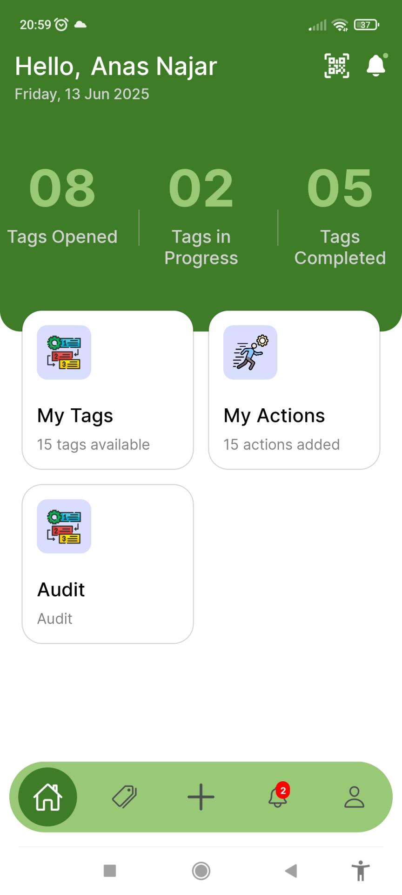
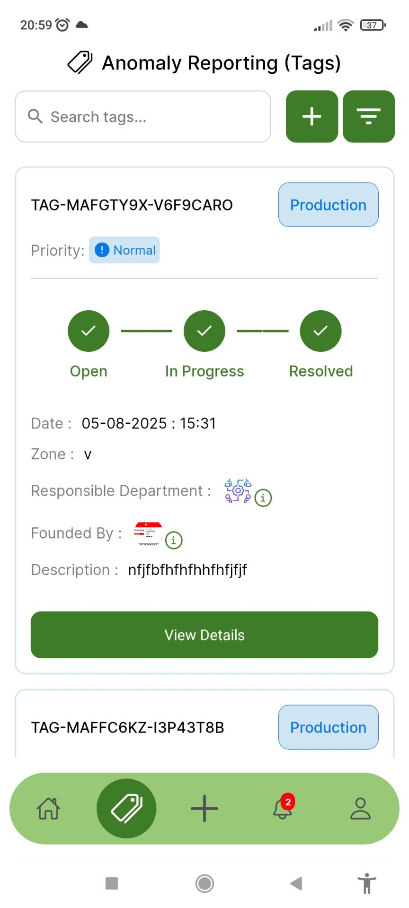
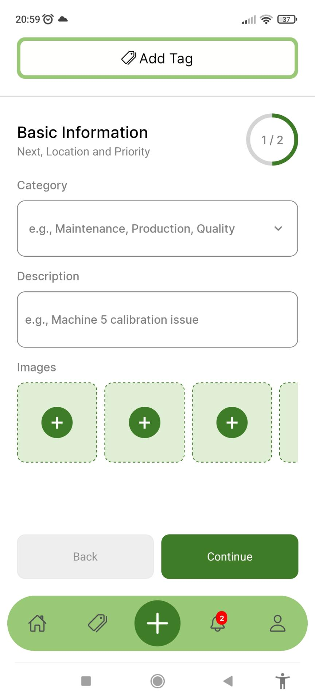
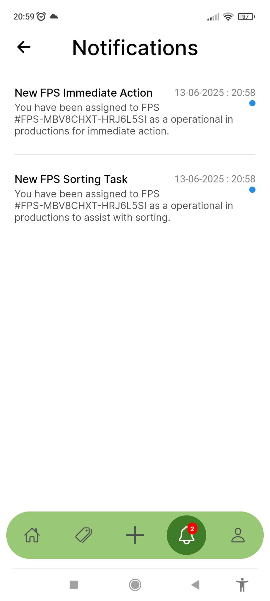
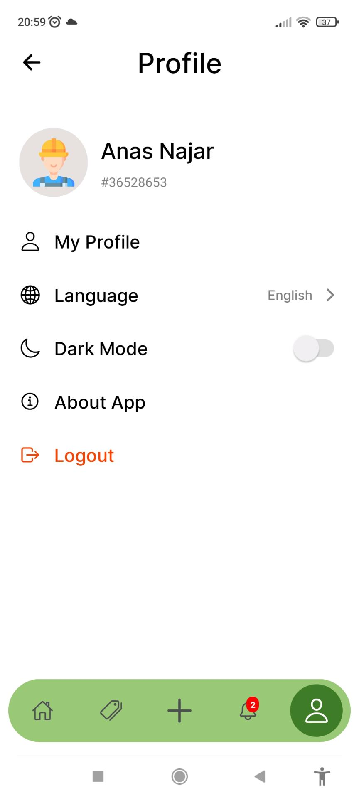

# Aradis - Smart Manufacturing Operations Platform

<div align="center">
  
  
  [](https://reactnative.dev/)
  [](https://expo.dev/)
  [](https://reactnative.dev/)
  [](LICENSE)
</div>

## 📱 Screenshots

<div align="center">
  
  <p><b>Home Screen</b></p>
  
  <p><b>Tags Overview</b></p>
  
  <p><b>Add Tag Workflow</b></p>
  
  <p><b>Notifications Center</b></p>
  
  <p><b>User Profile</b></p>
</div>

## 🎯 Overview

**Aradis** is a comprehensive smart manufacturing operations platform designed to streamline industrial processes through advanced anomaly detection, failure diagnosis, and real-time monitoring. Built with React Native and Expo, this mobile application empowers manufacturing teams to efficiently manage QRAPs (Quick Response Action Plans), track anomalies, and maintain operational excellence.

### Key Objectives
- **Failure Diagnosis**: Quickly identify and resolve machine failures with advanced diagnostic tools
- **Anomaly Reporting**: Report and track anomalies in real-time to prevent production disruptions
- **Quick Problem Resolution**: Manage QRAPs for fast and effective issue resolution
- **Historical Data Analysis**: Access detailed reports and analytics for continuous improvement
- **Real-Time Notifications**: Stay informed with instant alerts for critical issues

## ✨ Features

### 🔍 Core Functionality
- **QR Code Scanner**: Scan TAG and FPS QR codes for instant anomaly identification
- **Tag Management**: Create, track, and manage anomaly report tags with detailed categorization
- **Action Tracking**: Monitor task progress with real-time status updates
- **FPS (Failure Problem Solving)**: Comprehensive problem-solving workflow with 5-step process
- **Real-time Notifications**: Instant alerts for critical issues and task updates

### 🎨 User Experience
- **Multi-language Support**: English, Arabic, and French localization
- **Dark/Light Theme**: Adaptive theming with automatic system preference detection
- **Responsive Design**: Optimized for various screen sizes and orientations
- **Offline Capability**: Basic functionality available without internet connection
- **Intuitive Navigation**: Tab-based navigation with smooth transitions

### 🔧 Technical Features
- **Secure Authentication**: JWT-based authentication with encrypted storage
- **Real-time Updates**: WebSocket integration for live data synchronization
- **Image Management**: Camera integration for anomaly documentation
- **Data Persistence**: Local storage with cloud synchronization
- **Push Notifications**: Firebase integration for instant alerts

### 📊 Analytics & Reporting
- **Dashboard Statistics**: Real-time overview of open, in-progress, and completed tasks
- **Filtering & Search**: Advanced filtering by category, priority, date, and status
- **Progress Tracking**: Visual progress indicators for task completion
- **Historical Data**: Comprehensive reporting and analytics capabilities


## 🛠 Technology Stack

### Frontend
- **React Native** (0.76.9) - Cross-platform mobile development
- **Expo** (52.0.44) - Development platform and build tools
- **React Navigation** (7.x) - Navigation and routing
- **Redux Toolkit** (2.8.1) - State management
- **React Native Reanimated** (3.16.1) - Smooth animations

### UI/UX Libraries
- **@gorhom/bottom-sheet** (5.1.1) - Bottom sheet components
- **react-native-modal** (14.0.0) - Modal dialogs
- **react-native-popup-menu** (0.16.1) - Context menus
- **@shopify/flash-list** (1.7.3) - High-performance list rendering
- **react-native-gesture-handler** (2.20.2) - Touch handling

### Internationalization
- **i18next** (24.2.2) - Internationalization framework
- **react-i18next** (15.4.1) - React integration
- **react-native-localize** (3.4.1) - Device locale detection

### Camera & Media
- **expo-camera** (16.0.18) - Camera functionality
- **expo-image-picker** (16.0.6) - Image selection
- **expo-image** (2.0.7) - Optimized image rendering

### Notifications & Real-time
- **expo-notifications** (0.29.14) - Push notifications
- **socket.io-client** (4.8.1) - Real-time communication
- **@react-native-firebase/app** (21.13.0) - Firebase integration

### Storage & Security
- **@react-native-async-storage/async-storage** (1.23.1) - Local storage
- **react-native-encrypted-storage** (4.0.3) - Secure data storage
- **react-native-keychain** (10.0.0) - Secure credential storage

### Utilities
- **date-fns** (4.1.0) - Date manipulation
- **react-native-get-random-values** (1.11.0) - Cryptography support
- **@react-native-community/netinfo** (11.4.1) - Network connectivity

## 📋 Prerequisites

Before running this project, ensure you have the following installed:

- **Node.js** (v18 or higher)
- **npm** or **yarn** package manager
- **Expo CLI** (`npm install -g @expo/cli`)
- **Android Studio** (for Android development)
- **Xcode** (for iOS development, macOS only)
- **Git**

## 🚀 Installation

1. **Clone the repository**
   ```bash
   git clone https://github.com/najaranas/aradis.git
   cd aradis
   ```

2. **Install dependencies**
   ```bash
   npm install
   # or
   yarn install
   ```

3. **Install Expo CLI globally** (if not already installed)
   ```bash
   npm install -g @expo/cli
   ```

4. **Start the development server**
   ```bash
   npm start
   # or
   expo start
   ```

## ⚙️ Configuration

### Environment Variables
Create a `.env` file in the root directory with the following variables:

```env
EXPO_PUBLIC_API_BASE_URL=your_api_base_url
EXPO_PUBLIC_FIREBASE_CONFIG=your_firebase_config
```

### Firebase Setup
1. Create a Firebase project at [Firebase Console](https://console.firebase.google.com/)
2. Download `google-services.json` and place it in the `android/app/` directory
3. Configure Firebase settings in your project

### API Configuration
Update the API endpoints in `utils/api/` files according to your backend configuration.

## 📱 Usage

### Development
```bash
# Start Expo development server
npm start

# Run on Android
npm run android

# Run on iOS
npm run ios

# Run on web
npm run web
```

### Building for Production
```bash
# Build for Android
eas build --platform android

# Build for iOS
eas build --platform ios
```

## 📁 Project Structure

```
aradis/
├── android/                 # Android-specific configuration
├── assets/                  # Static assets (images, fonts, sounds)
│   ├── fonts/              # Custom fonts
│   ├── icons/              # App icons and UI icons
│   ├── images/             # Images and logos
│   └── sounds/             # Notification sounds
├── components/             # Reusable UI components
│   ├── card/              # Card-related components
│   ├── formPages/         # Form page components
│   └── handlers/          # Event handlers
├── constants/             # App constants and configuration
├── hooks/                 # Custom React hooks
├── navigation/            # Navigation configuration
├── screens/               # Main application screens
│   └── ProfileScreens/    # Profile-related screens
├── store/                 # Redux store configuration
│   └── slices/           # Redux slices
├── translations/          # Internationalization files
├── utils/                 # Utility functions and API calls
│   └── api/              # API integration files
├── App.js                 # Main application component
├── app.json              # Expo configuration
├── package.json          # Dependencies and scripts
└── README.md             # Project documentation
```

## 🔌 API Integration

The application integrates with a RESTful API for data management:

### Authentication
- JWT-based authentication
- Token storage in encrypted storage
- Automatic token refresh

### Endpoints
- **Tags API**: `/tags/*` - Tag management operations
- **Actions API**: `/actions/*` - Action tracking operations
- **User API**: `/user/*` - User management
- **Notifications API**: `/notifications/*` - Notification handling

### Real-time Communication
- WebSocket integration for live updates
- Push notifications via Firebase
- Offline data synchronization

## 🌍 Internationalization

The application supports multiple languages:

- **English** (en) - Default language
- **Arabic** (ar) - RTL support
- **French** (fr) - European localization

### Adding New Languages
1. Create a new translation file in `translations/`
2. Add language configuration in `constants/data.js`
3. Update the language selector component

## 🗃 State Management

The application uses Redux Toolkit for state management:

### Store Structure
- **userSlice**: User authentication and profile data
- **themeSlice**: Application theme preferences
- **notificationsSlice**: Notification state management

### Key Features
- Immutable state updates
- DevTools integration
- Middleware for side effects
- Persisted state for offline functionality

## 🤝 Contributing

We welcome contributions to improve Aradis! Please follow these steps:

1. **Fork the repository**
2. **Create a feature branch** (`git checkout -b feature/amazing-feature`)
3. **Commit your changes** (`git commit -m 'Add amazing feature'`)
4. **Push to the branch** (`git push origin feature/amazing-feature`)
5. **Open a Pull Request**

### Development Guidelines
- Follow the existing code style and conventions
- Write meaningful commit messages
- Add tests for new features
- Update documentation as needed
- Ensure all tests pass before submitting

## 📄 License

This project is licensed under the MIT License - see the [LICENSE](LICENSE) file for details.

## 👨‍💻 Author

**Anas Najar**
- GitHub: [@anasnajar](https://github.com/anasnajar)
- Email: [anasnajar.tn@gmail.com]

## 🙏 Acknowledgments

- **ARA Solutions** - For the innovative platform concept
- **Expo Team** - For the excellent development platform
- **React Native Community** - For the amazing ecosystem
- **All Contributors** - For their valuable contributions

---

<div align="center">
  <p>Made with ❤️ for smart manufacturing</p>
  <p>Built with React Native & Expo</p>
</div> 